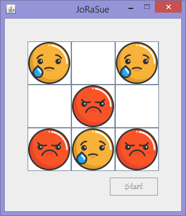
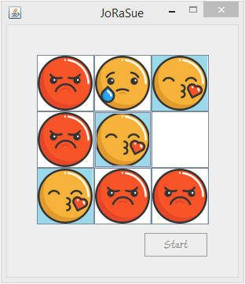

# EngHack-Project
This is my group's version of tic-tac-toe using different kinds of emojis. We made it using Java in Eclipse IDE.    
It starts with an angry and a crying emoji assigned to each player.   If the angry emoji player wins, his/her emoji changes to a happy face emoji and if the crying face emoji player wins, his emoji changes to a kiss face emoji.
 
This is just to add a little spark of fun to the usual tic-tac-toe, which is our favourite solution to boredom. :) 
 
Here's a little sneak peek into the game:    
</img>
</img>    
We are planning on developing it further to add more emojis and allow users to choose their emojis before playing the game.
